# Super Brain Desktop - 架构设计文档

## 项目背景

### 用户需求
基于 OpenClaw（开源私人助手）的桌面端增强版本，目标是突破其沙盒环境限制，赋予 AI 助手更强的"眼睛"和"手脚"能力。

### 核心需求
1. **性能强** - 原生性能，支持实时监控场景（如股票软件数据变更分析）
2. **扩展性强** - 插件化架构，支持未来功能扩展
3. **跨端支持好** - Mac 和 Windows 都能流畅运行

### OpenClaw 简介
- **定位**: 开源的个人 AI 助手，可在本地设备上运行
- **核心能力**:
  - 通过沙盒环境执行任务
  - 支持多种消息平台（WhatsApp、Telegram、Slack 等）
  - 提供文件读写、shell 命令执行、浏览器控制
  - Gateway 作为本地控制平面管理会话、通道、工具和事件
- **架构特点**:
  - 在 Docker 容器中运行，提供隔离沙盒
  - 支持完全访问或沙盒模式
  - WebSocket/HTTP API 通信

### 原始计划参考
用户提供的初始方案建议：
- 使用 Rust 作为后端核心
- 采用 Tauri 框架
- React (Vite) + TypeScript 前端
- 通过 Tauri IPC 进行前后端通信
- 实现聊天界面、工作区浏览器等功能

---

## 🏗️ 顶层架构设计

### 核心设计理念
在原有三大需求基础上，增加第四个维度：
1. **性能** - Performance
2. **扩展性** - Extensibility
3. **跨平台** - Cross-platform
4. **实时性** - Real-time Capability（支持实时监控等高频场景）

### 整体架构图

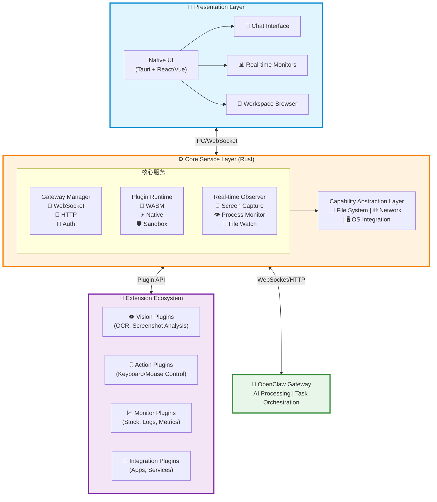

### 数据流说明

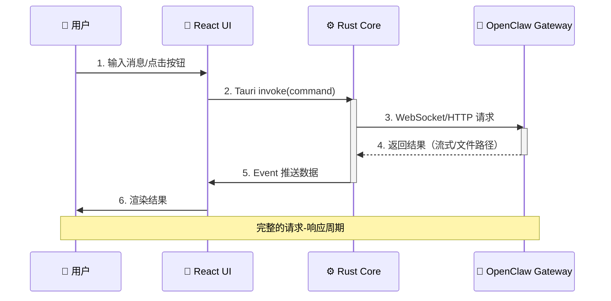

---

## 用户界面设计

### 主界面布局

```mermaid
graph TB
    subgraph MainWindow["🖥️ 主窗口"]
        subgraph TitleBar["标题栏"]
            AppIcon["🦞 Logo"]
            Title["Super Brain"]
            MinMax["最小化/最大化/关闭"]
        end

        subgraph LeftSidebar["📱 左侧边栏 (200px)"]
            SessionList["📝 会话列表"]
            NewSession["➕ 新建会话"]
            WorkspaceBtn["📁 工作区"]
            MonitorBtn["📊 监控面板"]
            PluginBtn["🧩 插件管理"]
        end

        subgraph CenterArea["💬 中心区域"]
            ChatHeader["会话标题 | 🔗 连接状态"]
            MessageList["消息列表<br/>(流式渲染)"]
            InputArea["📝 输入框<br/>📎 附件 | 📸 截图 | 🎤 语音"]
        end

        subgraph RightPanel["🔧 右侧面板 (可折叠)"]
            FileTree["📂 文件浏览器"]
            MonitorList["👁️ 活动监控"]
            PluginList["🧩 活动插件"]
        end
    end

    TitleBar --> LeftSidebar
    TitleBar --> CenterArea
    LeftSidebar --> CenterArea
    CenterArea --> RightPanel

    style MainWindow fill:#f5f5f5,stroke:#333,stroke-width:2px
    style TitleBar fill:#e1f5ff,stroke:#0288d1,stroke-width:1px
    style LeftSidebar fill:#fff3e0,stroke:#f57c00,stroke-width:1px
    style CenterArea fill:#e8f5e9,stroke:#388e3c,stroke-width:1px
    style RightPanel fill:#f3e5f5,stroke:#7b1fa2,stroke-width:1px
```

### 监控配置界面

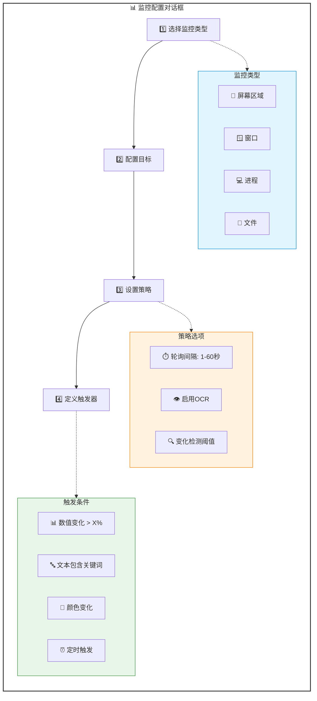

## 核心模块设计

### 1. Real-time Observer Engine（实时观察引擎）

这是"眼睛和手脚"功能的核心实现。

#### 架构设计

```mermaid
graph LR
    subgraph ObserverEngine["🔍 Observer Engine"]
        SC["📸 Screen Capturer"]
        PM["⚙️ Process Monitor"]
        WT["🪟 Window Tracker"]
        OCR["📝 OCR Engine"]
        EB["📡 Event Bus"]
    end

    subgraph ObservationType["观察类型"]
        SR["📐 Screen Region"]
        SW["🪟 Specific Window"]
        PO["💻 Process Output"]
        FC["📂 File Changes"]
        CC["📋 Clipboard"]
    end

    subgraph Outputs["输出"]
        Data["📊 提取数据"]
        Events["⚡ 触发事件"]
        Actions["🎯 执行动作"]
    end

    ObservationType --> ObserverEngine
    ObserverEngine --> Outputs

    style ObserverEngine fill:#fff3e0,stroke:#f57c00,stroke-width:2px
    style ObservationType fill:#e1f5ff,stroke:#0288d1,stroke-width:2px
    style Outputs fill:#e8f5e9,stroke:#388e3c,stroke-width:2px
```
```rust
pub struct ObserverEngine {
    // 屏幕捕获模块
    screen_capturer: ScreenCapturer,
    // 进程监控
    process_monitor: ProcessMonitor,
    // 窗口变化检测
    window_tracker: WindowTracker,
    // OCR 引擎
    ocr_engine: OcrEngine,
    // 事件总线
    event_bus: EventBus,
}

// 支持的观察类型
pub enum ObservationType {
    ScreenRegion(Rect),           // 监控屏幕区域
    SpecificWindow(WindowId),     // 监控特定窗口
    ProcessOutput(ProcessId),     // 监控进程输出
    FileChanges(PathBuf),         // 监控文件变化
    ClipboardChanges,             // 监控剪贴板
}

// 观察策略
pub struct ObservationStrategy {
    interval: Duration,           // 轮询间隔
    trigger: TriggerCondition,    // 触发条件
    extractor: DataExtractor,     // 数据提取器
}
```

#### 关键技术点
- **跨平台屏幕捕获**:
  - 使用 `scrap` (Rust crate)
  - 或自建基于 Core Graphics (macOS) / DXGI (Windows)
- **OCR 引擎**:
  - 集成 Tesseract 或 PaddleOCR（通过 FFI）
- **性能优化**:
  - 使用 Rust 的 `tokio` 异步运行时
  - 避免阻塞主线程

#### 应用场景
- 实时监控股票软件数据变化
- 追踪特定应用的状态变化
- 自动化任务触发（当检测到特定内容时执行操作）

#### 实时监控工作流程

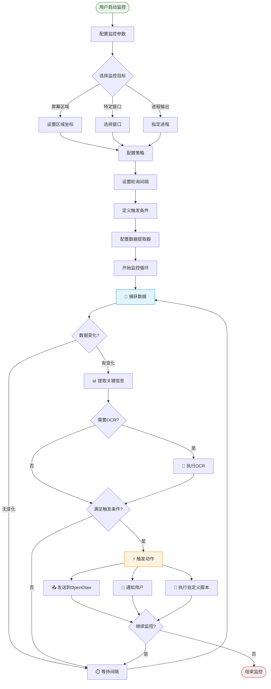

---

### 2. Plugin Runtime（插件运行时）

采用 **WASM + Native Hybrid** 混合模式。

#### 架构设计

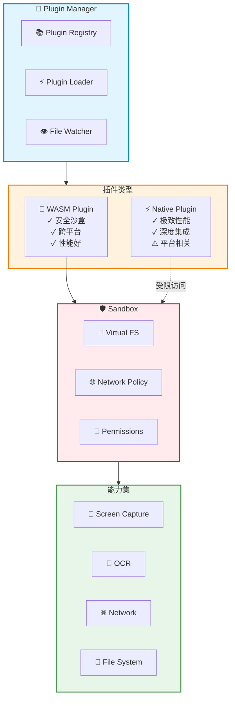
```rust
pub enum PluginType {
    // WASM 插件：安全、跨平台、性能适中
    Wasm(WasmPlugin),
    // Native 插件：高性能、平台相关
    Native(NativePlugin),
}

pub trait Plugin {
    fn init(&mut self, context: &PluginContext) -> Result<()>;
    fn execute(&self, input: Value) -> Result<Value>;
    fn capabilities(&self) -> Vec<Capability>;
}

// 插件沙盒
pub struct Sandbox {
    filesystem: VirtualFs,        // 虚拟文件系统
    network: NetworkPolicy,       // 网络策略
    permissions: PermissionSet,   // 权限集合
}
```

#### 为什么选择 WASM？
- **安全性**: 完全沙盒化，无法直接访问系统
- **跨平台**: 一次编写，到处运行
- **性能**: 接近原生的执行速度
- **生态**: 可以用 Rust/C/C++/AssemblyScript 编写插件

#### Native Plugin 使用场景
- 需要极致性能（如实时视频处理）
- 需要深度系统集成（如键盘钩子、底层驱动交互）

#### 插件生命周期

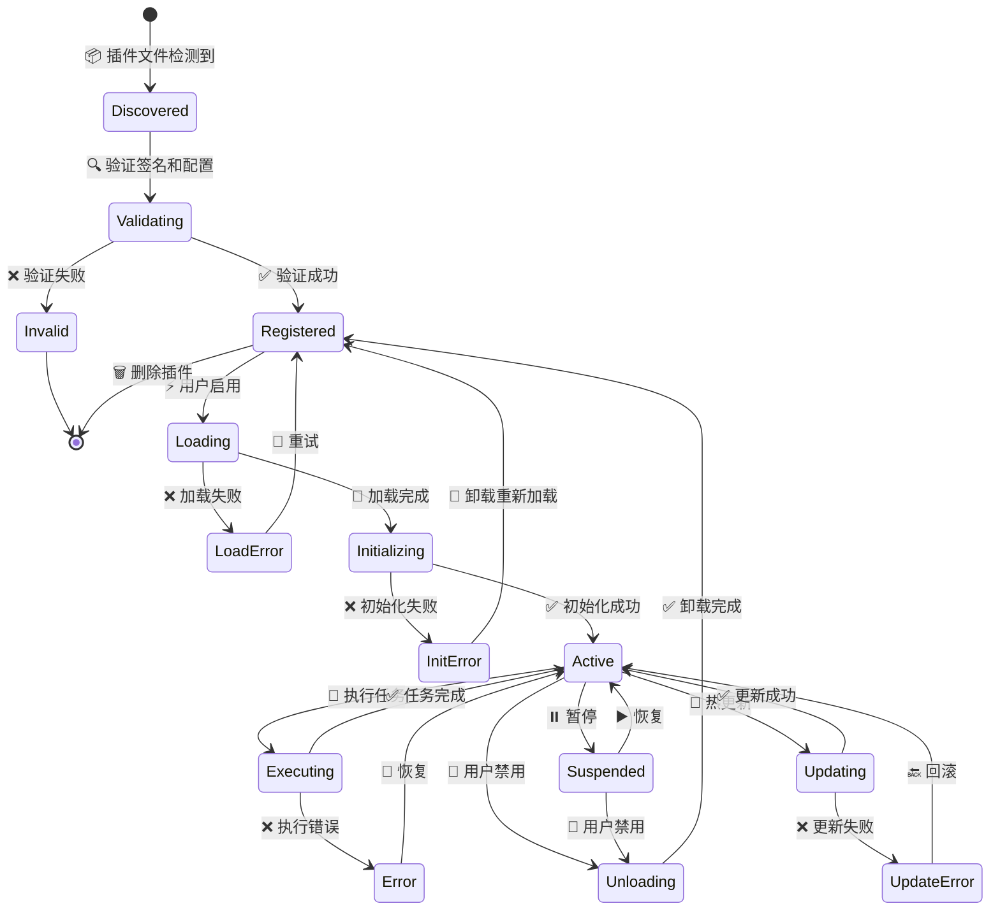

#### 插件示例配置
```yaml
plugin-manifest.yaml:
  name: "stock-monitor"
  version: "1.0.0"
  type: "wasm"
  capabilities:
    - screen_capture
    - ocr
    - network
  entry: "stock_monitor.wasm"
  config_schema: "./schema.json"
```

#### 热更新支持
```rust
pub struct PluginManager {
    registry: HashMap<String, Plugin>,
    watcher: FileWatcher,
}

impl PluginManager {
    // 热重载插件
    pub async fn reload_plugin(&mut self, name: &str) -> Result<()> {
        self.unload_plugin(name)?;
        self.load_plugin(name)?;
        Ok(())
    }
}
```

---

### 3. Gateway Manager（网关管理器）

负责与 OpenClaw Gateway 的通信。

#### 架构设计
```rust
pub struct GatewayManager {
    connection: ConnectionPool,
    session_manager: SessionManager,
    stream_handler: StreamHandler,
}

// 支持多种通信模式
pub enum CommunicationMode {
    // 传统请求-响应
    RequestResponse,
    // 流式响应（AI 生成）
    Streaming,
    // 双向实时通信（监控数据上报）
    Bidirectional,
}

// 智能重连机制
pub struct ReconnectionStrategy {
    backoff: ExponentialBackoff,
    max_retries: u32,
    health_check: Box<dyn Fn() -> bool>,
}
```

#### 核心能力
- WebSocket 长连接管理
- HTTP 请求/响应处理
- 认证和会话管理
- 流式数据处理（AI 生成内容）
- 断线重连和容错

---

### 4. Capability Abstraction Layer（能力抽象层）

统一抽象不同操作系统的能力差异。

#### 架构设计
```rust
#[trait_variant::make(Send)]
pub trait FileSystemOps {
    async fn read(&self, path: &Path) -> Result<Vec<u8>>;
    async fn write(&self, path: &Path, data: &[u8]) -> Result<()>;
    async fn watch(&self, path: &Path) -> Result<Watcher>;
}

#[trait_variant::make(Send)]
pub trait WindowOps {
    async fn list_windows(&self) -> Result<Vec<Window>>;
    async fn get_active_window(&self) -> Result<Window>;
    async fn capture_window(&self, id: WindowId) -> Result<Image>;
}

// 平台实现
#[cfg(target_os = "macos")]
mod macos_impl;

#[cfg(target_os = "windows")]
mod windows_impl;
```

#### 抽象的能力域
- **文件系统**: 读写、监听、权限管理
- **窗口管理**: 列举、捕获、控制
- **进程管理**: 启动、监控、注入
- **系统集成**: 托盘、通知、快捷键

---

### 5. 前端 Rust Commands（Tauri API）

暴露给前端的核心接口。

```rust
// 消息发送
#[tauri::command]
async fn send_message(
    session_id: String,
    message: String
) -> Result<MessageResponse, String>;

// 工作区文件操作
#[tauri::command]
fn list_workspace_files() -> Result<Vec<String>, String>;

#[tauri::command]
fn read_file(path: String) -> Result<String, String>;

// 截图功能
#[tauri::command]
async fn capture_screen(region: Option<Rect>) -> Result<String, String>;

// 启动实时监控
#[tauri::command]
async fn start_monitoring(
    target: MonitorTarget,
    strategy: ObservationStrategy
) -> Result<String, String>;

// 停止监控
#[tauri::command]
async fn stop_monitoring(monitor_id: String) -> Result<(), String>;

// 插件管理
#[tauri::command]
async fn install_plugin(path: String) -> Result<PluginInfo, String>;

#[tauri::command]
async fn list_plugins() -> Result<Vec<PluginInfo>, String>;
```

---

## 性能优化策略

### 1. 多线程架构

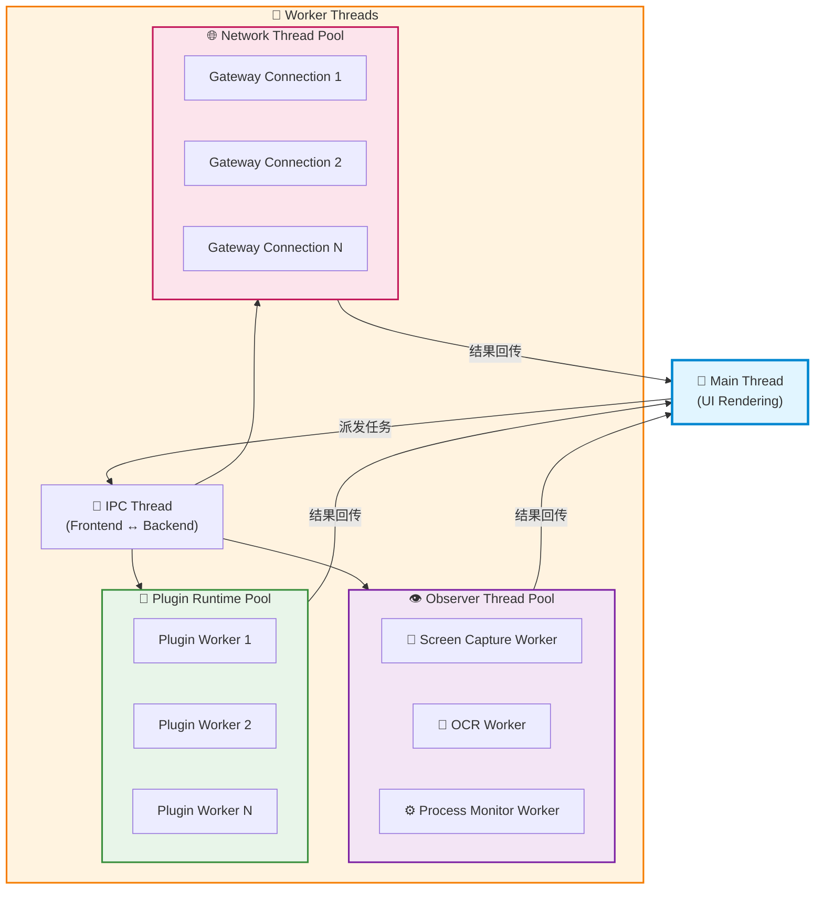

**设计原则**:
- UI 线程保持轻量，只负责渲染
- 耗时操作全部异步化
- 使用线程池避免线程创建开销

### 2. 零拷贝数据传输

**问题**: 图像数据在进程/线程间传输开销大

**解决方案**:
- 使用 `SharedMemory` 在进程间传输图像数据
- 使用 `zeromq` 或 `nanomsg` 进行高性能 IPC
- 前端使用 `SharedArrayBuffer` 接收大数据
- 图像数据用指针传递，避免拷贝

### 3. 增量更新

**屏幕捕获优化**:
- 只传输变化区域（Diff Algorithm）
- 使用运动检测算法减少不必要的 OCR
- 缓存已识别的区域内容

**数据序列化**:
- 使用 Protocol Buffers 或 FlatBuffers
- 避免 JSON 的解析开销

### 4. 性能监控

从第一天开始埋点:
```rust
use tracing::{info, instrument};

#[instrument]
async fn capture_and_ocr(region: Rect) -> Result<String> {
    let _span = tracing::span!(tracing::Level::INFO, "capture_and_ocr");
    // 实现...
}
```

---

## 跨平台方案对比

| 方案 | 性能 | 开发效率 | 平台支持 | 生态系统 | 推荐度 |
|------|------|---------|---------|---------|--------|
| **Tauri** | ⭐⭐⭐⭐ | ⭐⭐⭐⭐⭐ | Mac/Win/Linux | ⭐⭐⭐⭐ | ⭐⭐⭐⭐⭐ |
| Electron | ⭐⭐ | ⭐⭐⭐⭐⭐ | Mac/Win/Linux | ⭐⭐⭐⭐⭐ | ⭐⭐ |
| Flutter Desktop | ⭐⭐⭐⭐ | ⭐⭐⭐⭐ | Mac/Win/Linux | ⭐⭐⭐ | ⭐⭐⭐⭐ |
| Qt/QML | ⭐⭐⭐⭐⭐ | ⭐⭐⭐ | Mac/Win/Linux | ⭐⭐⭐⭐ | ⭐⭐⭐ |
| **纯 Rust (egui/iced)** | ⭐⭐⭐⭐⭐ | ⭐⭐⭐ | Mac/Win/Linux | ⭐⭐ | ⭐⭐⭐⭐ |

### 推荐方案: Tauri + 选择性 Native 模块

**理由**:
- ✅ 主应用用 Tauri（快速开发 + 良好性能）
- ✅ 性能关键模块用纯 Rust（如实时监控引擎）
- ✅ 前端用熟悉的 React/Vue 技术栈
- ✅ 安装包小（~3-5MB vs Electron 的 ~100MB）
- ✅ 内存占用低（~50MB vs Electron 的 ~200MB）

---

## MVP 功能范围

基于 80/20 原则的功能优先级划分。

### 核心功能（v1.0 必须实现）

1. ✅ **与 OpenClaw Gateway 的稳定连接**
   - WebSocket 长连接
   - 认证和会话管理
   - 断线重连

2. ✅ **多会话聊天界面**
   - 会话列表
   - 流式消息渲染
   - 历史记录

3. ✅ **本地工作区文件浏览和编辑**
   - 文件树展示
   - 文件预览
   - 简单编辑功能

4. ✅ **基础屏幕捕获**
   - 手动截图
   - 选择区域截图
   - 发送给 AI 分析

5. ✅ **系统托盘集成**
   - 最小化到托盘
   - 快捷键唤醒
   - 系统通知

### 进阶功能（v1.1+）

6. 🔄 **实时区域监控**
   - 设置监控区域
   - 定时自动捕获
   - 变化检测触发

7. 🔄 **OCR 自动提取**
   - 图像文字识别
   - 表格数据提取
   - 多语言支持

8. 🔄 **键盘/鼠标自动化**
   - 脚本录制
   - 自动化执行
   - 条件触发

9. 🔄 **插件系统**
   - 插件市场
   - 一键安装
   - 热更新

---

## 开发路线图

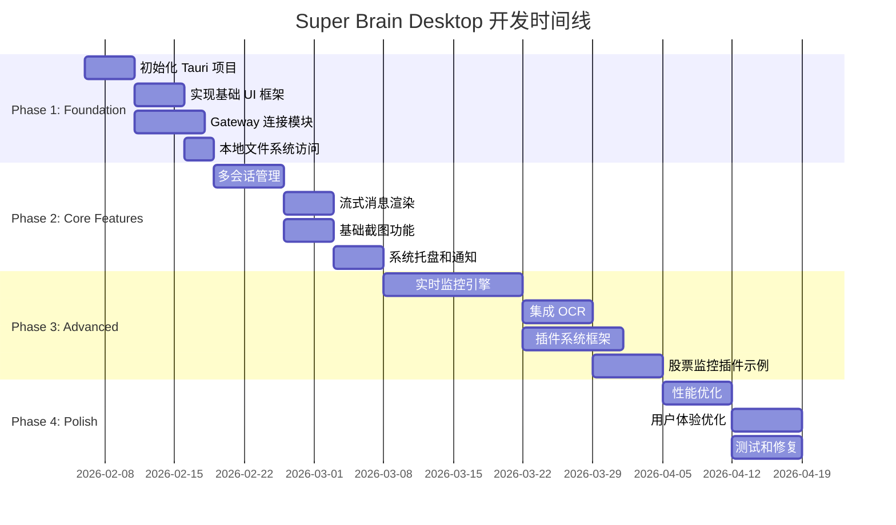

### Phase 1: Foundation（2-3 weeks）

**目标**: 搭建项目基础架构

- [ ] 初始化 Tauri 项目
  - 配置 Rust 后端
  - 配置 React + TypeScript 前端
  - 配置构建脚本

- [ ] 实现基础 UI 框架
  - 布局组件（侧边栏、主内容区）
  - 路由系统
  - 主题系统（深色/浅色模式）

- [ ] 实现 Gateway 连接模块
  - WebSocket 客户端
  - 连接状态管理
  - 心跳保活

- [ ] 实现本地文件系统访问
  - 文件读写 API
  - 权限管理
  - 安全检查

**交付物**:
- 可运行的桌面应用骨架
- 能连接到 OpenClaw Gateway

---

### Phase 2: Core Features（3-4 weeks）

**目标**: 实现核心用户功能

- [ ] 实现多会话管理
  - 会话创建/删除/切换
  - 会话状态持久化
  - 会话元数据管理

- [ ] 实现流式消息渲染
  - SSE/WebSocket 流处理
  - 打字机效果
  - Markdown 渲染
  - 代码高亮

- [ ] 实现基础截图功能
  - 全屏截图
  - 区域选择
  - 图片上传到 Gateway

- [ ] 实现系统托盘和通知
  - 托盘图标和菜单
  - 系统通知
  - 全局快捷键

**交付物**:
- 完整的聊天功能
- 基础的视觉输入能力

---

### Phase 3: Advanced Capabilities（4-6 weeks）

**目标**: 实现差异化的高级功能

- [ ] 实现实时监控引擎
  - 屏幕区域监控
  - 窗口追踪
  - 进程监控
  - 文件变化监听

- [ ] 集成 OCR
  - Tesseract 集成
  - 图像预处理
  - 文本提取 API

- [ ] 实现插件系统基础框架
  - WASM 运行时
  - 插件加载/卸载
  - 权限管理
  - API 暴露

- [ ] 开发第一个示例插件
  - 股票监控插件
  - 定时捕获股票软件
  - 数据提取和分析
  - 告警触发

**交付物**:
- 具备实时监控能力的完整产品
- 可扩展的插件系统

---

### Phase 4: Polish & Optimization（2-3 weeks）

**目标**: 优化性能和用户体验

- [ ] 性能优化
  - 性能基准测试
  - 内存优化
  - 启动速度优化
  - 响应时间优化

- [ ] 用户体验优化
  - 动画和过渡效果
  - 错误处理和提示
  - 快捷键系统
  - 可访问性支持

- [ ] 测试和修复
  - 单元测试
  - 集成测试
  - Bug 修复
  - 文档完善

**交付物**:
- 可发布的 v1.0 版本

---

## 技术风险评估

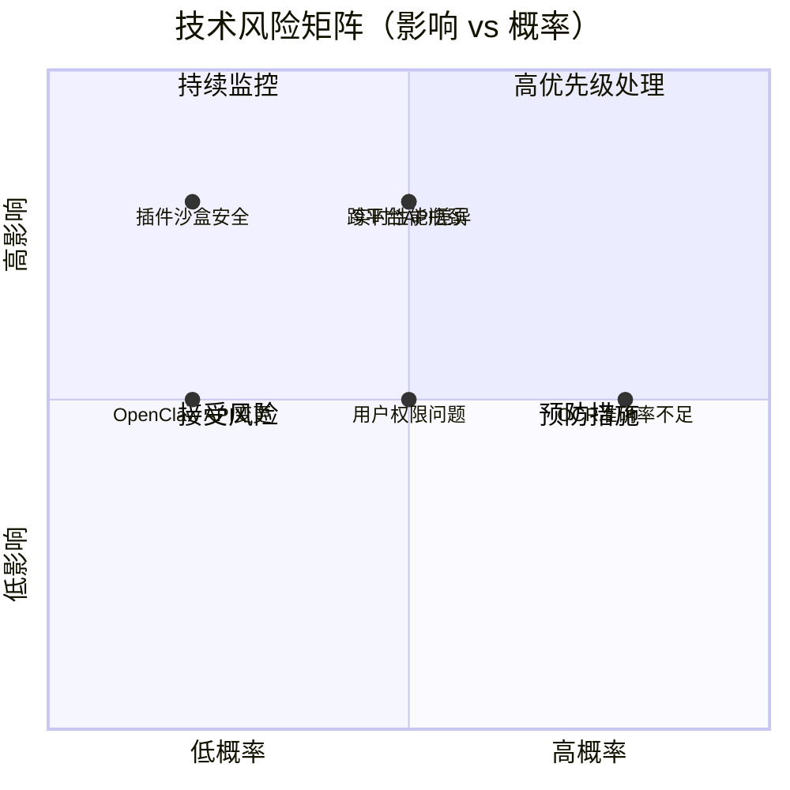

### 风险详情与缓解方案

| 风险 | 影响 | 概率 | 缓解方案 |
|------|------|------|---------|
| 跨平台 API 差异 | 高 | 中 | 使用成熟库如 `tauri-plugin-*`，早期在两个平台测试 |
| 实时性能瓶颈 | 高 | 中 | 早期做性能基准测试，使用 profiler 定位瓶颈 |
| OCR 准确率不足 | 中 | 高 | 支持多引擎切换，提供手动校正机制 |
| 插件沙盒安全性 | 高 | 低 | WASM 优先，Native 插件严格审核 |
| OpenClaw API 变更 | 中 | 低 | 版本兼容检测，适配层设计 |
| 用户权限问题 | 中 | 中 | 清晰的权限请求说明，提供降级方案 |

---

## 技术栈总结

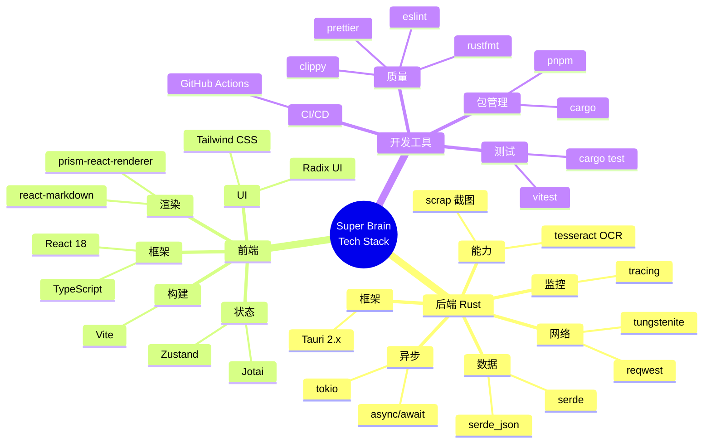

### 后端（Rust）
- **框架**: Tauri 2.x
- **异步运行时**: tokio
- **HTTP 客户端**: reqwest
- **WebSocket**: tungstenite
- **序列化**: serde + serde_json
- **日志**: tracing + tracing-subscriber
- **屏幕捕获**: scrap 或平台原生 API
- **OCR**: tesseract-rs

### 前端
- **框架**: React 18 + TypeScript
- **构建工具**: Vite
- **状态管理**: Zustand 或 Jotai
- **UI 组件**: Radix UI + Tailwind CSS
- **Markdown 渲染**: react-markdown
- **代码高亮**: prism-react-renderer

### 开发工具
- **包管理**: pnpm (前端) + cargo (Rust)
- **代码格式化**: prettier + rustfmt
- **代码检查**: eslint + clippy
- **测试**: vitest (前端) + cargo test (Rust)
- **CI/CD**: GitHub Actions

---

## 下一步行动建议

### 立即开始（1-2 天）
1. **创建 Tauri 原型**
   - 初始化项目
   - 实现 Hello World
   - 测试前后端通信

2. **验证核心技术**
   - 测试屏幕捕获在 Mac/Windows 上的表现
   - 测试与 OpenClaw Gateway 的连接
   - 验证性能基准

### 短期目标（1-2 周）
3. **实现 MVP 核心功能**
   - 聊天界面
   - 截图功能
   - OpenClaw 集成

4. **性能监控埋点**
   - 从第一天开始埋点
   - 建立性能基线

### 中期目标（1-2 月）
5. **实现实时监控引擎**
   - 这是最核心的差异化功能
   - 需要重点投入

6. **插件系统预留接口**
   - 即使 v1.0 不完整实现
   - 架构要支持未来扩展

---

## 参考资源

### 官方文档
- Tauri 官方文档: https://tauri.app/
- Rust 官方文档: https://doc.rust-lang.org/
- OpenClaw 文档: https://docs.openclaw.ai/

### 相关技术
- WebAssembly: https://webassembly.org/
- Tokio 异步运行时: https://tokio.rs/
- Tesseract OCR: https://github.com/tesseract-ocr/tesseract

### 类似项目参考
- Raycast (Mac 效率工具)
- PowerToys (Windows 效率工具)
- AutoHotkey (自动化脚本)

---

## 附录：关键代码示例

### Tauri Command 示例

```rust
// src-tauri/src/commands/messaging.rs

use tauri::State;
use crate::gateway::GatewayManager;

#[tauri::command]
pub async fn send_message(
    gateway: State<'_, GatewayManager>,
    session_id: String,
    content: String,
) -> Result<String, String> {
    gateway
        .send_message(&session_id, content)
        .await
        .map_err(|e| e.to_string())
}

#[tauri::command]
pub async fn create_session(
    gateway: State<'_, GatewayManager>,
) -> Result<String, String> {
    gateway
        .create_session()
        .await
        .map_err(|e| e.to_string())
}
```

### 前端调用示例

```typescript
// src/services/gateway.ts

import { invoke } from '@tauri-apps/api/tauri';

export class GatewayService {
  async sendMessage(sessionId: string, content: string): Promise<string> {
    return await invoke<string>('send_message', {
      sessionId,
      content,
    });
  }

  async createSession(): Promise<string> {
    return await invoke<string>('create_session');
  }
}
```

### 实时监控示例

```rust
// src-tauri/src/observer/mod.rs

use std::time::Duration;
use tokio::time::interval;

pub struct ScreenObserver {
    region: Rect,
    interval: Duration,
}

impl ScreenObserver {
    pub async fn start(&self) -> Result<()> {
        let mut ticker = interval(self.interval);

        loop {
            ticker.tick().await;

            let screenshot = capture_region(self.region)?;
            let text = ocr_extract(&screenshot)?;

            // 发送到 Gateway 或触发回调
            self.on_data_changed(text).await?;
        }
    }
}
```

---

**文档版本**: v1.0
**创建日期**: 2026-02-06
**最后更新**: 2026-02-06
