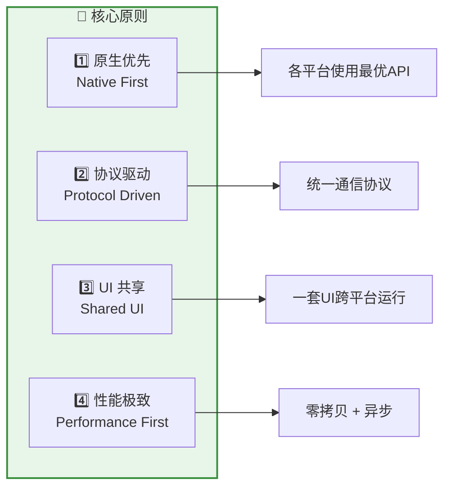
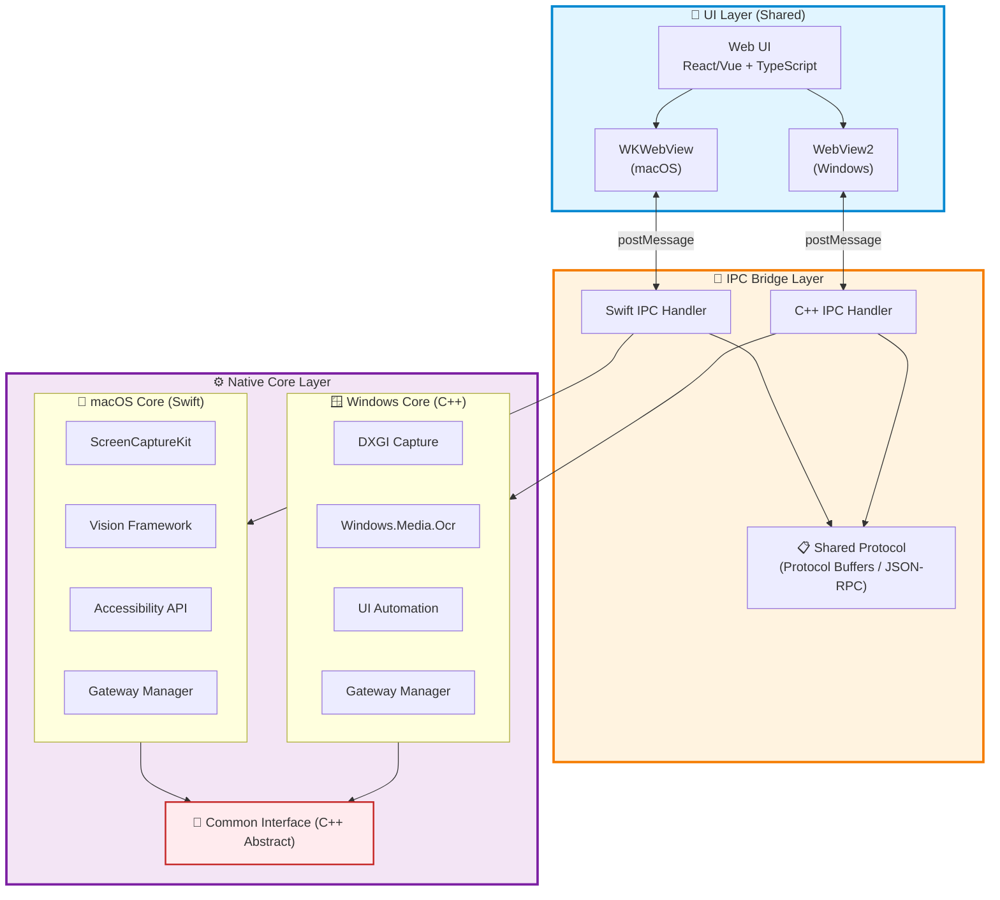
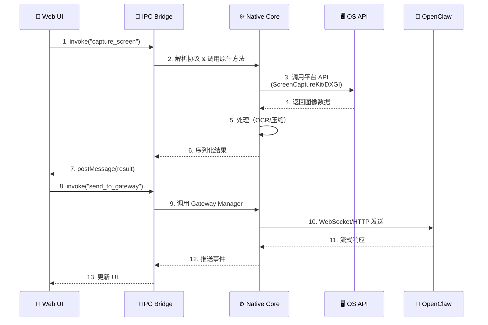
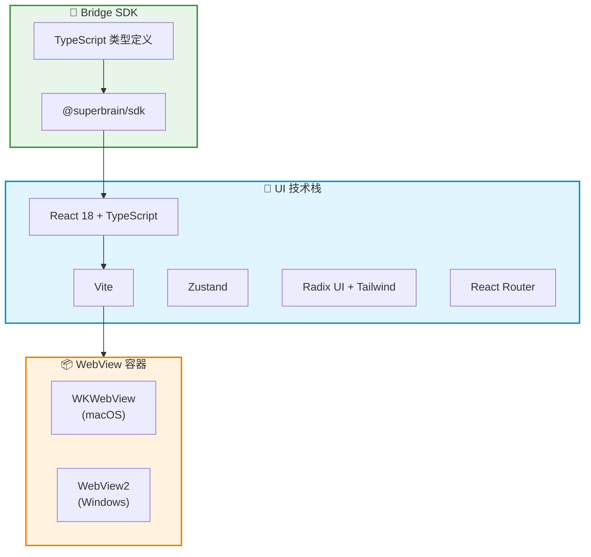

# Super Brain - 跨平台原生架构设计
## macOS (Swift) + Windows (C++) + 共享 UI 层

---

## 目录

1. [核心设计理念](#核心设计理念)
2. [整体架构](#整体架构)
3. [共享协议层设计](#共享协议层设计)
4. [UI 统一方案](#ui-统一方案)
5. [平台特定实现](#平台特定实现)
6. [项目结构](#项目结构)
7. [通信协议](#通信协议)
8. [开发工作流](#开发工作流)

---

## 核心设计理念

### 设计原则



### 关键决策

| 决策点 | 选择 | 理由 |
|--------|------|------|
| **UI 技术** | Web (React/Vue) + WebView | 最灵活，一次开发两端运行 |
| **通信方式** | IPC + JSON-RPC | 简单可靠，易于调试 |
| **共享代码** | Protocol Buffers | 跨语言，性能好，类型安全 |
| **macOS 原生** | Swift + ScreenCaptureKit | 最佳性能和系统集成 |
| **Windows 原生** | C++ + Windows API | 最佳性能和系统集成 |
| **跨平台抽象** | C++ 接口层 | Swift 可通过 C 桥接调用 |

---

## 整体架构

### 三层架构设计



### 数据流



---

## 共享协议层设计

### 协议定义方式

我们使用 **Protocol Buffers** 定义核心数据结构，**JSON-RPC** 作为调用协议。

#### 1. Protocol Buffers (数据结构)

```protobuf
// shared/protos/messages.proto

syntax = "proto3";
package superbrain;

// 通用响应
message Response {
  bool success = 1;
  string error_message = 2;
  bytes data = 3;
}

// 屏幕捕获请求
message CaptureScreenRequest {
  optional Rectangle region = 1;
  bool include_cursor = 2;
  ImageFormat format = 3;

  message Rectangle {
    int32 x = 1;
    int32 y = 2;
    int32 width = 3;
    int32 height = 4;
  }

  enum ImageFormat {
    PNG = 0;
    JPEG = 1;
    RAW = 2;
  }
}

// 屏幕捕获响应
message CaptureScreenResponse {
  bytes image_data = 1;
  int32 width = 2;
  int32 height = 3;
  int64 timestamp = 4;
}

// OCR 请求
message OCRRequest {
  bytes image_data = 1;
  repeated string languages = 2;
  RecognitionLevel level = 3;

  enum RecognitionLevel {
    FAST = 0;
    ACCURATE = 1;
  }
}

// OCR 响应
message OCRResponse {
  repeated TextBlock blocks = 1;

  message TextBlock {
    string text = 1;
    float confidence = 2;
    Rectangle bounds = 3;
  }
}

// 监控配置
message MonitorConfig {
  string id = 1;
  MonitorType type = 2;
  Target target = 3;
  Strategy strategy = 4;
  repeated Trigger triggers = 5;

  enum MonitorType {
    SCREEN_REGION = 0;
    WINDOW = 1;
    PROCESS = 2;
    FILE = 3;
  }

  message Target {
    oneof target_type {
      Rectangle region = 1;
      string window_title = 2;
      int32 process_id = 3;
      string file_path = 4;
    }
  }

  message Strategy {
    int32 interval_ms = 1;
    bool enable_ocr = 2;
    float change_threshold = 3;
  }

  message Trigger {
    TriggerCondition condition = 1;
    repeated Action actions = 2;

    enum TriggerCondition {
      VALUE_CHANGE = 0;
      TEXT_CONTAINS = 1;
      COLOR_CHANGE = 2;
      TIMER = 3;
    }

    message Action {
      ActionType type = 1;
      string payload = 2;

      enum ActionType {
        NOTIFY = 0;
        SEND_TO_GATEWAY = 1;
        EXECUTE_SCRIPT = 2;
      }
    }
  }
}

// Gateway 消息
message GatewayMessage {
  string session_id = 1;
  MessageType type = 2;
  string content = 3;
  repeated Attachment attachments = 4;

  enum MessageType {
    TEXT = 0;
    IMAGE = 1;
    FILE = 2;
  }

  message Attachment {
    string filename = 1;
    string mime_type = 2;
    bytes data = 3;
  }
}
```

#### 2. JSON-RPC (方法调用)

```typescript
// shared/protocol/rpc.ts

export interface RPCRequest {
  jsonrpc: '2.0';
  id: string | number;
  method: string;
  params?: any;
}

export interface RPCResponse {
  jsonrpc: '2.0';
  id: string | number;
  result?: any;
  error?: RPCError;
}

export interface RPCError {
  code: number;
  message: string;
  data?: any;
}

// 定义所有 RPC 方法
export type RPCMethod =
  // 屏幕捕获
  | 'screen.capture'
  | 'screen.startRecording'
  | 'screen.stopRecording'

  // OCR
  | 'ocr.recognizeText'
  | 'ocr.recognizeRegion'

  // 窗口管理
  | 'window.list'
  | 'window.focus'
  | 'window.capture'

  // 监控
  | 'monitor.create'
  | 'monitor.start'
  | 'monitor.stop'
  | 'monitor.list'

  // Gateway
  | 'gateway.connect'
  | 'gateway.disconnect'
  | 'gateway.sendMessage'
  | 'gateway.createSession'

  // 插件
  | 'plugin.install'
  | 'plugin.uninstall'
  | 'plugin.list'
  | 'plugin.execute';

// 类型安全的方法签名
export interface RPCMethods {
  'screen.capture': {
    params: { region?: Rectangle; format?: 'png' | 'jpeg' };
    result: { imageData: string; width: number; height: number };
  };

  'ocr.recognizeText': {
    params: { imageData: string; languages?: string[] };
    result: { text: string; confidence: number; blocks: TextBlock[] };
  };

  'monitor.create': {
    params: MonitorConfig;
    result: { monitorId: string };
  };

  'gateway.sendMessage': {
    params: { sessionId: string; content: string; attachments?: Attachment[] };
    result: { messageId: string };
  };

  // ... 其他方法
}
```

### 协议实现

#### macOS (Swift)

```swift
// Platform/macOS/Sources/IPC/RPCHandler.swift

import Foundation

class RPCHandler {
    private let screenService: ScreenCaptureService
    private let ocrService: OCRService
    private let monitorService: MonitorService
    private let gatewayManager: GatewayManager

    init() {
        self.screenService = ScreenCaptureService()
        self.ocrService = OCRService()
        self.monitorService = MonitorService()
        self.gatewayManager = GatewayManager()
    }

    func handleRequest(_ request: RPCRequest) async -> RPCResponse {
        do {
            let result = try await routeMethod(request.method, params: request.params)
            return RPCResponse(
                jsonrpc: "2.0",
                id: request.id,
                result: result
            )
        } catch {
            return RPCResponse(
                jsonrpc: "2.0",
                id: request.id,
                error: RPCError(
                    code: -32603,
                    message: error.localizedDescription
                )
            )
        }
    }

    private func routeMethod(_ method: String, params: Any?) async throws -> Any {
        switch method {
        case "screen.capture":
            let req = try decode(CaptureScreenRequest.self, from: params)
            return try await screenService.capture(region: req.region)

        case "ocr.recognizeText":
            let req = try decode(OCRRequest.self, from: params)
            return try await ocrService.recognize(imageData: req.imageData)

        case "monitor.create":
            let config = try decode(MonitorConfig.self, from: params)
            return try await monitorService.create(config: config)

        case "gateway.sendMessage":
            let msg = try decode(GatewayMessage.self, from: params)
            return try await gatewayManager.sendMessage(msg)

        default:
            throw RPCError(code: -32601, message: "Method not found: \(method)")
        }
    }

    private func decode<T: Decodable>(_ type: T.Type, from params: Any?) throws -> T {
        guard let params = params else {
            throw RPCError(code: -32602, message: "Invalid params")
        }
        let data = try JSONSerialization.data(withJSONObject: params)
        return try JSONDecoder().decode(T.self, from: data)
    }
}
```

#### Windows (C++)

```cpp
// Platform/Windows/src/IPC/RPCHandler.cpp

#include "RPCHandler.h"
#include <nlohmann/json.hpp>

using json = nlohmann::json;

class RPCHandler {
private:
    std::unique_ptr<ScreenCaptureService> screenService;
    std::unique_ptr<OCRService> ocrService;
    std::unique_ptr<MonitorService> monitorService;
    std::unique_ptr<GatewayManager> gatewayManager;

public:
    RPCHandler()
        : screenService(std::make_unique<ScreenCaptureService>())
        , ocrService(std::make_unique<OCRService>())
        , monitorService(std::make_unique<MonitorService>())
        , gatewayManager(std::make_unique<GatewayManager>())
    {}

    json handleRequest(const json& request) {
        try {
            std::string method = request["method"];
            json params = request.value("params", json::object());

            json result = routeMethod(method, params);

            return json{
                {"jsonrpc", "2.0"},
                {"id", request["id"]},
                {"result", result}
            };
        } catch (const std::exception& e) {
            return json{
                {"jsonrpc", "2.0"},
                {"id", request["id"]},
                {"error", {
                    {"code", -32603},
                    {"message", e.what()}
                }}
            };
        }
    }

private:
    json routeMethod(const std::string& method, const json& params) {
        if (method == "screen.capture") {
            CaptureScreenRequest req = params.get<CaptureScreenRequest>();
            return screenService->capture(req);
        }
        else if (method == "ocr.recognizeText") {
            OCRRequest req = params.get<OCRRequest>();
            return ocrService->recognize(req);
        }
        else if (method == "monitor.create") {
            MonitorConfig config = params.get<MonitorConfig>();
            return monitorService->create(config);
        }
        else if (method == "gateway.sendMessage") {
            GatewayMessage msg = params.get<GatewayMessage>();
            return gatewayManager->sendMessage(msg);
        }
        else {
            throw std::runtime_error("Method not found: " + method);
        }
    }
};
```

---

## UI 统一方案

### 技术选型



### UI 项目结构

```
UI/
├── package.json
├── tsconfig.json
├── vite.config.ts
├── index.html
├── src/
│   ├── main.tsx                    # 入口文件
│   ├── App.tsx                     # 根组件
│   │
│   ├── bridge/                     # 平台桥接层
│   │   ├── index.ts                # 统一导出
│   │   ├── types.ts                # 类型定义
│   │   ├── client.ts               # RPC 客户端
│   │   └── events.ts               # 事件监听
│   │
│   ├── views/                      # 页面组件
│   │   ├── Chat/
│   │   │   ├── ChatView.tsx
│   │   │   ├── MessageList.tsx
│   │   │   └── InputArea.tsx
│   │   ├── Monitor/
│   │   │   ├── MonitorDashboard.tsx
│   │   │   ├── MonitorConfig.tsx
│   │   │   └── MonitorList.tsx
│   │   ├── Workspace/
│   │   │   ├── FileTree.tsx
│   │   │   └── FileViewer.tsx
│   │   └── Plugins/
│   │       ├── PluginMarket.tsx
│   │       └── PluginManager.tsx
│   │
│   ├── components/                 # 通用组件
│   │   ├── Layout/
│   │   ├── Sidebar/
│   │   └── Toast/
│   │
│   ├── stores/                     # 状态管理
│   │   ├── chatStore.ts
│   │   ├── monitorStore.ts
│   │   └── settingsStore.ts
│   │
│   ├── hooks/                      # 自定义 Hooks
│   │   ├── useNative.ts
│   │   ├── useMonitor.ts
│   │   └── useGateway.ts
│   │
│   └── utils/                      # 工具函数
│       ├── format.ts
│       └── validation.ts
│
└── dist/                           # 构建输出
    ├── index.html
    ├── assets/
    └── ...
```

### Bridge SDK 实现

```typescript
// UI/src/bridge/client.ts

import type { RPCRequest, RPCResponse, RPCMethods } from './types';

class NativeBridge {
  private requestId = 0;
  private pendingRequests = new Map<number, {
    resolve: (value: any) => void;
    reject: (error: any) => void;
  }>();

  constructor() {
    this.setupMessageHandler();
  }

  private setupMessageHandler() {
    // macOS: WKWebView
    if (window.webkit?.messageHandlers?.nativeBridge) {
      window.addEventListener('message', (event) => {
        this.handleResponse(event.data);
      });
    }
    // Windows: WebView2
    else if (window.chrome?.webview) {
      window.chrome.webview.addEventListener('message', (event) => {
        this.handleResponse(event.data);
      });
    }
  }

  private handleResponse(response: RPCResponse) {
    const pending = this.pendingRequests.get(response.id as number);
    if (!pending) return;

    this.pendingRequests.delete(response.id as number);

    if (response.error) {
      pending.reject(new Error(response.error.message));
    } else {
      pending.resolve(response.result);
    }
  }

  async invoke<M extends keyof RPCMethods>(
    method: M,
    params?: RPCMethods[M]['params']
  ): Promise<RPCMethods[M]['result']> {
    const id = ++this.requestId;

    const request: RPCRequest = {
      jsonrpc: '2.0',
      id,
      method,
      params,
    };

    // 发送到原生层
    if (window.webkit?.messageHandlers?.nativeBridge) {
      window.webkit.messageHandlers.nativeBridge.postMessage(request);
    } else if (window.chrome?.webview) {
      window.chrome.webview.postMessage(request);
    } else {
      throw new Error('Native bridge not available');
    }

    // 等待响应
    return new Promise((resolve, reject) => {
      this.pendingRequests.set(id, { resolve, reject });
    });
  }

  // 监听原生事件
  on(event: string, handler: (data: any) => void) {
    window.addEventListener(`native:${event}`, (e: CustomEvent) => {
      handler(e.detail);
    });
  }
}

export const nativeBridge = new NativeBridge();
```

### 使用示例

```typescript
// UI/src/hooks/useScreenCapture.ts

import { useState } from 'react';
import { nativeBridge } from '@/bridge';
import type { CaptureScreenRequest, CaptureScreenResponse } from '@/bridge/types';

export function useScreenCapture() {
  const [capturing, setCapturing] = useState(false);
  const [error, setError] = useState<string | null>(null);

  const capture = async (region?: CaptureScreenRequest['region']) => {
    setCapturing(true);
    setError(null);

    try {
      const result = await nativeBridge.invoke('screen.capture', {
        region,
        format: 'png',
      });

      return result;
    } catch (err) {
      setError(err instanceof Error ? err.message : 'Unknown error');
      throw err;
    } finally {
      setCapturing(false);
    }
  };

  return { capture, capturing, error };
}

// UI/src/views/Chat/InputArea.tsx

function InputArea() {
  const { capture, capturing } = useScreenCapture();
  const { sendMessage } = useGateway();

  const handleScreenshot = async () => {
    try {
      const screenshot = await capture();

      await sendMessage({
        sessionId: currentSessionId,
        content: '这是我的截图，请帮我分析',
        attachments: [{
          filename: 'screenshot.png',
          mimeType: 'image/png',
          data: screenshot.imageData,
        }],
      });
    } catch (error) {
      console.error('Screenshot failed:', error);
    }
  };

  return (
    <div className="input-area">
      <button onClick={handleScreenshot} disabled={capturing}>
        {capturing ? '截图中...' : '📸 截图'}
      </button>
    </div>
  );
}
```

---

## 平台特定实现

### macOS (Swift) 实现

#### 项目结构

```
Platform/macOS/
├── SuperBrain.xcodeproj
├── SuperBrain/
│   ├── SuperBrainApp.swift         # App 入口
│   ├── AppDelegate.swift           # 生命周期管理
│   │
│   ├── UI/
│   │   ├── MainWindow.swift        # 主窗口
│   │   └── WebViewController.swift # WebView 控制器
│   │
│   ├── IPC/
│   │   ├── RPCHandler.swift        # RPC 处理器
│   │   ├── MessageHandler.swift    # 消息处理
│   │   └── EventEmitter.swift      # 事件发射器
│   │
│   ├── Services/
│   │   ├── ScreenCaptureService.swift
│   │   ├── OCRService.swift
│   │   ├── WindowMonitor.swift
│   │   ├── MonitorService.swift
│   │   └── GatewayManager.swift
│   │
│   ├── Bridge/
│   │   └── CXXBridge.swift         # C++ 桥接（如需要）
│   │
│   └── Resources/
│       ├── Assets.xcassets
│       ├── Info.plist
│       └── web/                    # 内嵌 Web UI
│           └── (Vite 构建产物)
│
└── SuperBrainTests/
```

#### 核心实现

```swift
// Platform/macOS/SuperBrain/SuperBrainApp.swift

import SwiftUI
import WebKit

@main
struct SuperBrainApp: App {
    @NSApplicationDelegateAdaptor(AppDelegate.self) var appDelegate

    var body: some Scene {
        WindowGroup {
            MainWindow()
        }
        .commands {
            CommandGroup(replacing: .newItem) { }
        }
    }
}

// Platform/macOS/SuperBrain/UI/MainWindow.swift

import SwiftUI
import WebKit

struct MainWindow: View {
    @StateObject private var webController = WebViewController()

    var body: some View {
        WebViewContainer(controller: webController)
            .frame(minWidth: 1200, minHeight: 800)
            .onAppear {
                webController.loadWebUI()
            }
    }
}

struct WebViewContainer: NSViewRepresentable {
    let controller: WebViewController

    func makeNSView(context: Context) -> WKWebView {
        return controller.webView
    }

    func updateNSView(_ nsView: WKWebView, context: Context) {}
}

// Platform/macOS/SuperBrain/UI/WebViewController.swift

import WebKit

class WebViewController: NSObject, ObservableObject {
    let webView: WKWebView
    private let rpcHandler: RPCHandler
    private let eventEmitter: EventEmitter

    override init() {
        // 配置 WebView
        let config = WKWebViewConfiguration()
        config.preferences.setValue(true, forKey: "developerExtrasEnabled")

        // 创建 WebView
        self.webView = WKWebView(frame: .zero, configuration: config)

        // 创建服务
        self.rpcHandler = RPCHandler()
        self.eventEmitter = EventEmitter(webView: webView)

        super.init()

        // 注入消息处理器
        config.userContentController.add(self, name: "nativeBridge")

        self.webView.navigationDelegate = self
    }

    func loadWebUI() {
        // 加载本地 Web UI
        if let url = Bundle.main.url(forResource: "index", withExtension: "html", subdirectory: "web") {
            webView.loadFileURL(url, allowingReadAccessTo: url.deletingLastPathComponent())
        }
    }
}

extension WebViewController: WKScriptMessageHandler {
    func userContentController(
        _ userContentController: WKUserContentController,
        didReceive message: WKScriptMessage
    ) {
        guard message.name == "nativeBridge",
              let body = message.body as? [String: Any],
              let data = try? JSONSerialization.data(withJSONObject: body),
              let request = try? JSONDecoder().decode(RPCRequest.self, from: data)
        else { return }

        // 异步处理请求
        Task {
            let response = await rpcHandler.handleRequest(request)
            await sendResponse(response)
        }
    }

    @MainActor
    private func sendResponse(_ response: RPCResponse) {
        guard let data = try? JSONEncoder().encode(response),
              let json = String(data: data, encoding: .utf8)
        else { return }

        let script = """
        window.dispatchEvent(new MessageEvent('message', { data: \(json) }));
        """

        webView.evaluateJavaScript(script)
    }
}

// Platform/macOS/SuperBrain/Services/ScreenCaptureService.swift

import ScreenCaptureKit
import CoreGraphics

class ScreenCaptureService {
    func capture(region: CGRect?) async throws -> CaptureScreenResponse {
        let content = try await SCShareableContent.current

        guard let display = content.displays.first else {
            throw NSError(domain: "ScreenCapture", code: -1, userInfo: [
                NSLocalizedDescriptionKey: "No display found"
            ])
        }

        let filter = SCContentFilter(display: display, excludingWindows: [])

        let config = SCStreamConfiguration()
        if let region = region {
            config.sourceRect = region
            config.width = Int(region.width)
            config.height = Int(region.height)
        }

        let image = try await SCScreenshotManager.captureImage(
            contentFilter: filter,
            configuration: config
        )

        // 转换为 PNG
        guard let data = image.pngData() else {
            throw NSError(domain: "ScreenCapture", code: -2, userInfo: [
                NSLocalizedDescriptionKey: "Failed to encode image"
            ])
        }

        return CaptureScreenResponse(
            imageData: data.base64EncodedString(),
            width: image.width,
            height: image.height,
            timestamp: Int64(Date().timeIntervalSince1970 * 1000)
        )
    }
}

extension CGImage {
    func pngData() -> Data? {
        let rep = NSBitmapImageRep(cgImage: self)
        return rep.representation(using: .png, properties: [:])
    }
}

// Platform/macOS/SuperBrain/Services/OCRService.swift

import Vision

class OCRService {
    func recognize(imageData: String) async throws -> OCRResponse {
        guard let data = Data(base64Encoded: imageData),
              let cgImage = NSImage(data: data)?.cgImage(forProposedRect: nil, context: nil, hints: nil)
        else {
            throw NSError(domain: "OCR", code: -1, userInfo: [
                NSLocalizedDescriptionKey: "Invalid image data"
            ])
        }

        let request = VNRecognizeTextRequest()
        request.recognitionLevel = .accurate
        request.recognitionLanguages = ["zh-Hans", "en-US"]

        let handler = VNImageRequestHandler(cgImage: cgImage)
        try handler.perform([request])

        guard let observations = request.results else {
            return OCRResponse(blocks: [])
        }

        let blocks = observations.compactMap { observation -> TextBlock? in
            guard let candidate = observation.topCandidates(1).first else { return nil }

            return TextBlock(
                text: candidate.string,
                confidence: candidate.confidence,
                bounds: observation.boundingBox
            )
        }

        return OCRResponse(blocks: blocks)
    }
}
```

### Windows (C++) 实现

#### 项目结构

```
Platform/Windows/
├── CMakeLists.txt
├── SuperBrain/
│   ├── main.cpp                    # 入口
│   │
│   ├── UI/
│   │   ├── MainWindow.h/cpp        # 主窗口
│   │   └── WebViewController.h/cpp # WebView2 控制器
│   │
│   ├── IPC/
│   │   ├── RPCHandler.h/cpp
│   │   └── EventEmitter.h/cpp
│   │
│   ├── Services/
│   │   ├── ScreenCaptureService.h/cpp  # DXGI 截图
│   │   ├── OCRService.h/cpp            # Windows.Media.Ocr
│   │   ├── WindowMonitor.h/cpp         # UI Automation
│   │   ├── MonitorService.h/cpp
│   │   └── GatewayManager.h/cpp
│   │
│   ├── Common/
│   │   ├── Interface.h             # 共享接口定义
│   │   └── Protocol.h              # 协议结构
│   │
│   └── Resources/
│       ├── app.manifest
│       ├── app.rc
│       └── web/                    # 内嵌 Web UI
│
├── ThirdParty/
│   ├── WebView2/
│   ├── nlohmann-json/
│   └── protobuf/
│
└── Tests/
```

#### 核心实现

```cpp
// Platform/Windows/SuperBrain/UI/WebViewController.h

#pragma once
#include <wil/com.h>
#include <WebView2.h>
#include <memory>
#include "../IPC/RPCHandler.h"

class WebViewController {
private:
    wil::com_ptr<ICoreWebView2Controller> webviewController;
    wil::com_ptr<ICoreWebView2> webview;
    std::unique_ptr<RPCHandler> rpcHandler;
    HWND parentHwnd;

public:
    WebViewController(HWND hwnd);

    void Initialize();
    void LoadWebUI();
    void Resize(int width, int height);

private:
    void SetupMessageHandler();
    void HandleMessage(const std::wstring& message);
};

// Platform/Windows/SuperBrain/UI/WebViewController.cpp

#include "WebViewController.h"
#include <nlohmann/json.hpp>
#include <fstream>
#include <sstream>

using json = nlohmann::json;

WebViewController::WebViewController(HWND hwnd)
    : parentHwnd(hwnd)
    , rpcHandler(std::make_unique<RPCHandler>())
{
    Initialize();
}

void WebViewController::Initialize() {
    // 创建 WebView2 环境
    CreateCoreWebView2EnvironmentWithOptions(
        nullptr, nullptr, nullptr,
        Microsoft::WRL::Callback<ICoreWebView2CreateCoreWebView2EnvironmentCompletedHandler>(
            [this](HRESULT result, ICoreWebView2Environment* env) -> HRESULT {
                // 创建 WebView2 控制器
                env->CreateCoreWebView2Controller(
                    parentHwnd,
                    Microsoft::WRL::Callback<ICoreWebView2CreateCoreWebView2ControllerCompletedHandler>(
                        [this](HRESULT result, ICoreWebView2Controller* controller) -> HRESULT {
                            if (controller != nullptr) {
                                webviewController = controller;
                                webviewController->get_CoreWebView2(&webview);

                                SetupMessageHandler();
                                LoadWebUI();
                            }
                            return S_OK;
                        }
                    ).Get()
                );
                return S_OK;
            }
        ).Get()
    );
}

void WebViewController::SetupMessageHandler() {
    // 添加消息处理器
    webview->AddScriptToExecuteOnDocumentCreated(
        LR"(
        window.chrome.webview.addEventListener('message', event => {
            window.dispatchEvent(new MessageEvent('message', { data: event.data }));
        });
        )",
        nullptr
    );

    // 监听来自 Web UI 的消息
    webview->add_WebMessageReceived(
        Microsoft::WRL::Callback<ICoreWebView2WebMessageReceivedEventHandler>(
            [this](ICoreWebView2* sender, ICoreWebView2WebMessageReceivedEventArgs* args) -> HRESULT {
                wil::unique_cotaskmem_string message;
                args->TryGetWebMessageAsString(&message);

                HandleMessage(message.get());

                return S_OK;
            }
        ).Get(),
        nullptr
    );
}

void WebViewController::HandleMessage(const std::wstring& messageStr) {
    // 转换为 UTF-8
    std::string utf8Message = WideToUtf8(messageStr);

    // 解析 JSON
    json request = json::parse(utf8Message);

    // 处理 RPC 请求
    std::async(std::launch::async, [this, request]() {
        json response = rpcHandler->handleRequest(request);

        // 发送响应回 Web UI
        std::wstring responseStr = Utf8ToWide(response.dump());
        webview->PostWebMessageAsJson(responseStr.c_str());
    });
}

void WebViewController::LoadWebUI() {
    // 获取应用目录
    wchar_t path[MAX_PATH];
    GetModuleFileNameW(nullptr, path, MAX_PATH);
    std::wstring appDir(path);
    appDir = appDir.substr(0, appDir.find_last_of(L"\\/"));

    // 加载 index.html
    std::wstring htmlPath = appDir + L"\\web\\index.html";
    webview->Navigate(htmlPath.c_str());
}

// Platform/Windows/SuperBrain/Services/ScreenCaptureService.cpp

#include "ScreenCaptureService.h"
#include <d3d11.h>
#include <dxgi1_2.h>
#include <wincodec.h>

class ScreenCaptureService {
private:
    Microsoft::WRL::ComPtr<ID3D11Device> d3dDevice;
    Microsoft::WRL::ComPtr<ID3D11DeviceContext> d3dContext;
    Microsoft::WRL::ComPtr<IDXGIOutputDuplication> deskDupl;

public:
    ScreenCaptureService() {
        InitializeDXGI();
    }

    CaptureScreenResponse Capture(const CaptureScreenRequest& request) {
        DXGI_OUTDUPL_FRAME_INFO frameInfo;
        Microsoft::WRL::ComPtr<IDXGIResource> desktopResource;

        // 获取下一帧
        HRESULT hr = deskDupl->AcquireNextFrame(500, &frameInfo, &desktopResource);
        if (FAILED(hr)) {
            throw std::runtime_error("Failed to capture frame");
        }

        // 转换为 ID3D11Texture2D
        Microsoft::WRL::ComPtr<ID3D11Texture2D> texture;
        hr = desktopResource.As(&texture);
        if (FAILED(hr)) {
            deskDupl->ReleaseFrame();
            throw std::runtime_error("Failed to get texture");
        }

        // 创建 staging texture 以读取数据
        D3D11_TEXTURE2D_DESC desc;
        texture->GetDesc(&desc);
        desc.Usage = D3D11_USAGE_STAGING;
        desc.CPUAccessFlags = D3D11_CPU_ACCESS_READ;
        desc.BindFlags = 0;

        Microsoft::WRL::ComPtr<ID3D11Texture2D> stagingTexture;
        d3dDevice->CreateTexture2D(&desc, nullptr, &stagingTexture);

        d3dContext->CopyResource(stagingTexture.Get(), texture.Get());

        // 读取像素数据
        D3D11_MAPPED_SUBRESOURCE mappedResource;
        d3dContext->Map(stagingTexture.Get(), 0, D3D11_MAP_READ, 0, &mappedResource);

        // 转换为 PNG
        std::vector<uint8_t> pngData = EncodeToPNG(
            static_cast<uint8_t*>(mappedResource.pData),
            desc.Width,
            desc.Height,
            mappedResource.RowPitch
        );

        d3dContext->Unmap(stagingTexture.Get(), 0);
        deskDupl->ReleaseFrame();

        // Base64 编码
        std::string base64 = Base64Encode(pngData);

        return CaptureScreenResponse{
            .imageData = base64,
            .width = static_cast<int32_t>(desc.Width),
            .height = static_cast<int32_t>(desc.Height),
            .timestamp = GetCurrentTimestampMs()
        };
    }

private:
    void InitializeDXGI() {
        // 创建 D3D11 设备
        D3D_FEATURE_LEVEL featureLevel;
        HRESULT hr = D3D11CreateDevice(
            nullptr,
            D3D_DRIVER_TYPE_HARDWARE,
            nullptr,
            0,
            nullptr,
            0,
            D3D11_SDK_VERSION,
            &d3dDevice,
            &featureLevel,
            &d3dContext
        );

        if (FAILED(hr)) {
            throw std::runtime_error("Failed to create D3D11 device");
        }

        // 获取 DXGI 设备
        Microsoft::WRL::ComPtr<IDXGIDevice> dxgiDevice;
        hr = d3dDevice.As(&dxgiDevice);

        // 获取适配器
        Microsoft::WRL::ComPtr<IDXGIAdapter> adapter;
        hr = dxgiDevice->GetAdapter(&adapter);

        // 获取输出
        Microsoft::WRL::ComPtr<IDXGIOutput> output;
        hr = adapter->EnumOutputs(0, &output);

        Microsoft::WRL::ComPtr<IDXGIOutput1> output1;
        hr = output.As(&output1);

        // 创建桌面复制
        hr = output1->DuplicateOutput(d3dDevice.Get(), &deskDupl);
        if (FAILED(hr)) {
            throw std::runtime_error("Failed to create desktop duplication");
        }
    }

    std::vector<uint8_t> EncodeToPNG(
        uint8_t* data,
        uint32_t width,
        uint32_t height,
        uint32_t stride
    ) {
        // 使用 WIC 编码为 PNG
        Microsoft::WRL::ComPtr<IWICImagingFactory> wicFactory;
        CoCreateInstance(
            CLSID_WICImagingFactory,
            nullptr,
            CLSCTX_INPROC_SERVER,
            IID_PPV_ARGS(&wicFactory)
        );

        // ... WIC 编码实现
        // (完整实现较长，这里省略)

        return {}; // 返回 PNG 字节数组
    }
};

// Platform/Windows/SuperBrain/Services/OCRService.cpp

#include "OCRService.h"
#include <winrt/Windows.Media.Ocr.h>
#include <winrt/Windows.Graphics.Imaging.h>

using namespace winrt;
using namespace Windows::Media::Ocr;
using namespace Windows::Graphics::Imaging;

class OCRService {
public:
    OCRResponse Recognize(const OCRRequest& request) {
        // 解码 Base64 图像
        std::vector<uint8_t> imageData = Base64Decode(request.imageData);

        // 创建 SoftwareBitmap
        auto bitmap = CreateSoftwareBitmap(imageData);

        // 创建 OCR 引擎
        auto ocrEngine = OcrEngine::TryCreateFromUserProfileLanguages();
        if (!ocrEngine) {
            throw std::runtime_error("OCR engine not available");
        }

        // 识别文本
        auto result = ocrEngine.RecognizeAsync(bitmap).get();

        // 转换结果
        OCRResponse response;
        for (const auto& line : result.Lines()) {
            TextBlock block;
            block.text = winrt::to_string(line.Text());
            block.confidence = 0.9f; // Windows OCR 不提供置信度

            auto rect = line.Words().GetAt(0).BoundingRect();
            block.bounds = Rectangle{
                static_cast<int32_t>(rect.X),
                static_cast<int32_t>(rect.Y),
                static_cast<int32_t>(rect.Width),
                static_cast<int32_t>(rect.Height)
            };

            response.blocks.push_back(block);
        }

        return response;
    }

private:
    SoftwareBitmap CreateSoftwareBitmap(const std::vector<uint8_t>& data) {
        // ... 实现图像解码
        return nullptr;
    }
};
```

---

## 完整项目结构

```
SuperBrain/
├── README.md
├── .gitignore
│
├── Shared/                         # 共享代码
│   ├── Protocol/                   # 协议定义
│   │   ├── protos/
│   │   │   ├── messages.proto
│   │   │   ├── services.proto
│   │   │   └── CMakeLists.txt
│   │   └── generated/              # 生成的代码
│   │       ├── swift/
│   │       └── cpp/
│   │
│   └── Interface/                  # C++ 抽象接口
│       ├── IScreenCapture.h
│       ├── IOCREngine.h
│       ├── IMonitorService.h
│       └── IGatewayManager.h
│
├── UI/                             # Web UI (共享)
│   ├── package.json
│   ├── tsconfig.json
│   ├── vite.config.ts
│   ├── src/
│   │   ├── main.tsx
│   │   ├── App.tsx
│   │   ├── bridge/
│   │   ├── views/
│   │   ├── components/
│   │   ├── stores/
│   │   └── hooks/
│   └── dist/                       # 构建输出
│
├── Platform/
│   ├── macOS/                      # macOS 原生实现
│   │   ├── SuperBrain.xcodeproj
│   │   ├── SuperBrain/
│   │   │   ├── SuperBrainApp.swift
│   │   │   ├── UI/
│   │   │   ├── IPC/
│   │   │   ├── Services/
│   │   │   └── Resources/
│   │   │       └── web/            # 链接到 UI/dist
│   │   └── SuperBrainTests/
│   │
│   └── Windows/                    # Windows 原生实现
│       ├── CMakeLists.txt
│       ├── SuperBrain/
│       │   ├── main.cpp
│       │   ├── UI/
│       │   ├── IPC/
│       │   ├── Services/
│       │   └── Resources/
│       │       └── web/            # 链接到 UI/dist
│       ├── ThirdParty/
│       └── Tests/
│
├── Scripts/                        # 构建脚本
│   ├── build-ui.sh                 # 构建 Web UI
│   ├── build-mac.sh                # 构建 macOS 版本
│   ├── build-win.sh                # 构建 Windows 版本
│   ├── generate-protocol.sh        # 生成协议代码
│   └── sync-ui.sh                  # 同步 UI 到各平台
│
└── Docs/                           # 文档
    ├── Architecture.md
    ├── Protocol.md
    ├── API.md
    └── Development.md
```

---

## 开发工作流

### 1. 初始化项目

```bash
# 克隆仓库
git clone <repository>
cd SuperBrain

# 生成协议代码
./Scripts/generate-protocol.sh

# 构建 UI
./Scripts/build-ui.sh

# 同步 UI 到各平台
./Scripts/sync-ui.sh
```

### 2. 开发 UI

```bash
cd UI

# 安装依赖
npm install

# 开发模式（热重载）
npm run dev

# 构建生产版本
npm run build
```

### 3. 开发 macOS 版本

```bash
# 同步最新 UI
./Scripts/sync-ui.sh

# 打开 Xcode
open Platform/macOS/SuperBrain.xcodeproj

# 或使用命令行构建
xcodebuild -project Platform/macOS/SuperBrain.xcodeproj \
           -scheme SuperBrain \
           -configuration Debug \
           build
```

### 4. 开发 Windows 版本

```bash
# 同步最新 UI
./Scripts/sync-ui.sh

# 使用 CMake 构建
cd Platform/Windows
mkdir build && cd build
cmake ..
cmake --build . --config Debug
```

### 5. 调试技巧

**macOS:**
```swift
// 启用 WebView 开发者工具
config.preferences.setValue(true, forKey: "developerExtrasEnabled")

// 右键 WebView -> Inspect Element
```

**Windows:**
```cpp
// 启用 WebView2 DevTools
webview->OpenDevToolsWindow();
```

**UI 调试:**
```bash
# UI 独立运行（模拟模式）
cd UI
npm run dev

# 会启动一个模拟的 native bridge
```

---

## 性能优化建议

### 1. 零拷贝传输

```swift
// macOS: 使用共享内存传输大数据
class SharedMemory {
    private let shm: UnsafeMutableRawPointer

    func writeImage(_ data: Data) {
        data.withUnsafeBytes { bytes in
            shm.copyMemory(from: bytes.baseAddress!, byteCount: bytes.count)
        }
    }
}
```

```cpp
// Windows: 同样使用共享内存
class SharedMemory {
private:
    HANDLE hMapFile;
    LPVOID pBuf;

public:
    void WriteImage(const std::vector<uint8_t>& data) {
        memcpy(pBuf, data.data(), data.size());
    }
};
```

### 2. 协议优化

```typescript
// UI: 使用 Protocol Buffers 替代 JSON（可选）
import { CaptureScreenRequest } from '@/generated/protocol';

const request = CaptureScreenRequest.encode({
  region: { x: 0, y: 0, width: 1920, height: 1080 },
  format: ImageFormat.PNG
}).finish();

// 发送二进制数据
nativeBridge.invokeBinary('screen.capture', request);
```

### 3. 增量更新

```swift
// macOS: 只传输变化的区域
class IncrementalCapture {
    private var lastFrame: CGImage?

    func captureDiff() -> Data? {
        let currentFrame = captureScreen()

        guard let last = lastFrame else {
            lastFrame = currentFrame
            return encodeImage(currentFrame)
        }

        let diff = computeDiff(last, currentFrame)
        lastFrame = currentFrame

        return encodeDiff(diff)
    }
}
```

---

## 部署和分发

### macOS

```bash
# 构建 Release 版本
xcodebuild -project Platform/macOS/SuperBrain.xcodeproj \
           -scheme SuperBrain \
           -configuration Release \
           archive \
           -archivePath ./build/SuperBrain.xcarchive

# 导出 .app
xcodebuild -exportArchive \
           -archivePath ./build/SuperBrain.xcarchive \
           -exportPath ./build/Release \
           -exportOptionsPlist ExportOptions.plist

# 签名和公证
codesign --deep --force --verify --verbose \
         --sign "Developer ID Application: Your Name" \
         ./build/Release/SuperBrain.app

# 创建 DMG
hdiutil create -volname "Super Brain" \
               -srcfolder ./build/Release/SuperBrain.app \
               -ov -format UDZO \
               SuperBrain.dmg
```

### Windows

```bash
# 构建 Release 版本
cmake --build ./build --config Release

# 使用 WiX 创建 MSI 安装包
# 或使用 NSIS 创建 EXE 安装包

# 签名
signtool sign /f cert.pfx /p password /t http://timestamp.server \
         SuperBrain-Setup.exe
```

---

## 总结

### 架构优势

✅ **原生性能**: 各平台使用最优 API
✅ **代码复用**: UI 层 100% 共享
✅ **类型安全**: Protocol Buffers + TypeScript
✅ **易于调试**: 清晰的分层架构
✅ **可扩展**: 插件系统预留接口

### 开发成本

| 模块 | macOS (Swift) | Windows (C++) | 共享 UI | 总计 |
|------|---------------|---------------|---------|------|
| UI 层 | 0 周 | 0 周 | 4 周 | 4 周 |
| IPC 层 | 1 周 | 1.5 周 | 0.5 周 | 3 周 |
| 核心服务 | 3 周 | 4 周 | 1 周 | 8 周 |
| 测试优化 | 1 周 | 1 周 | 0.5 周 | 2.5 周 |
| **总计** | **5 周** | **6.5 周** | **6 周** | **17.5 周** |

*注: 如果使用纯 Tauri，总开发时间约 12 周，但性能和系统集成会打折扣*

### 推荐的开发顺序

1. ✅ **Week 1-2**: 搭建项目结构 + UI 原型
2. ✅ **Week 3-4**: macOS 核心功能（更简单，先验证架构）
3. ✅ **Week 5-8**: Windows 移植（参考 macOS 实现）
4. ✅ **Week 9-10**: 完善 UI 和交互
5. ✅ **Week 11-12**: 性能优化和测试

---

**文档版本**: v1.0
**创建日期**: 2026-02-06
**最后更新**: 2026-02-06
